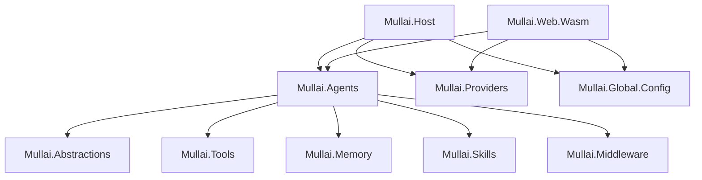

# Mullai 🌸

Mullai is a modern, extensible AI Agent framework built on .NET. It leverages `Microsoft.Extensions.AI` and `Microsoft.Agents.AI` to run intelligent, multi-turn AI agents equipped with tools, memory, and skills. 

Whether you want to interact with agents via a robust Console Application or a modern Blazor WebAssembly UI, Mullai provides a highly scalable architecture to build your own AI assistants.

## 🚀 Features

- **Extensible Agent Architecture**: Define distinct agent personalities (e.g., "Assistant", "Joker") with customized instructions and toolsets.
- **Rich Tool Ecosystem**: Equip your agents with built-in tools like `WeatherTool`, `CliTool`, and `FileSystemTool`, allowing them to interact with the external world.
- **Middleware Pipeline**: robust interception of agent interactions via `FunctionCallingMiddleware`, `PIIMiddleware`, and `GuardrailMiddleware`.
- **Memory & Skills**: Persistent `UserInfoMemory` and dynamic skill providers (`FileAgentSkillsProvider`) to give agents context and advanced capabilities.
- **Multi-Provider Support**: Seamlessly switch between different LLM providers (OpenAI, Ollama, OpenRouter) using standard abstraction layers.
- **Observability Built-in**: Out-of-the-box OpenTelemetry logging, metrics, and distributed tracing.
- **Frontend Choices**: 
  - `Mullai.Host` - A fast, interactive CLI host with streaming responses.
  - `Mullai.Web.Wasm` - A modern Blazor WebAssembly web application for a rich user interface.

## 🏗 Project Architecture

Mullai is designed with a modular, decoupled architecture:



### Core Components

- **`Mullai.Agents`**: Central core containing the `AgentFactory` and agent definitions.
- **`Mullai.Tools`**: Exposes capabilities like CLI execution and File System access to the LLM.
- **`Mullai.Middleware`**: Intercepts requests and responses to enforce guardrails, scrub PII, and handle function calling.
- **`Mullai.Providers`**: Pluggable LLM backends.
- **`Mullai.Memory` & `Mullai.Skills`**: Manages conversational history, user context, and dynamic capabilities.

## 🛠 Getting Started

### Prerequisites

- [.NET 10 SDK](https://dotnet.microsoft.com/download/dotnet/10.0)
- (Optional) Docker for running the OpenTelemetry observability stack.
- An API Key (OpenAI / OpenRouter) or a local LLM instance (like Ollama).

### Setup and Run

1. **Clone the repository:**
   ```bash
   git clone https://github.com/yourusername/Mullai.git
   cd Mullai
   ```

2. **Configure AppSettings:**
   Update the `appsettings.json` in `Mullai.Host` or `Mullai.Web.Wasm` with your preferred LLM provider credentials.

3. **Run the Console Host:**
   Dive right into a terminal session with the Assistant:
   ```bash
   cd Mullai.Host
   dotnet run
   ```

4. **Run the Blazor Web App:**
   Experience the agent via a modern web interface:
   ```bash
   cd Mullai.Web.Wasm/Mullai.Web.Wasm
   dotnet run
   ```

## 📊 Observability

Mullai includes an OpenTelemetry stack defined in the `docker/` folder. This allows you to collect logs, metrics, and distributed traces to monitor your agent workflows in production using Jaeger and Prometheus.

## 🤝 Contributing

Contributions are welcome! Whether it's adding new tools, middlewares, or improving the blazor UI:
1. Fork the repository.
2. Create your feature branch (`git checkout -b feature/NewTool`).
3. Commit your changes (`git commit -m 'Add some NewTool'`).
4. Push to the branch (`git push origin feature/NewTool`).
5. Open a Pull Request.

## 📄 License

This project is licensed under the MIT License.
