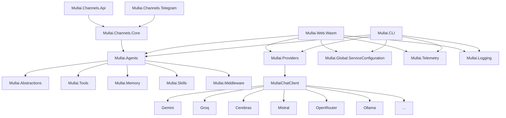

# Mullai — Advanced AI Assistant with Rich Console UI

<p align="center">
    <picture>
        
    </picture>
</p>

<p align="center">
  <strong>Build Intelligent, Extensible, and Observant AI Assistants with .NET</strong>
</p>

<p align="center">
  <a href="https://github.com/agentmatters/mullai-bot/stargazers"></a>
  <a href="https://github.com/agentmatters/mullai-bot/actions/workflows/dotnet.yml?branch=main"></a>
  <a href="https://discord.gg/YhDYt4g6Ja"></a>
  <a href="LICENSE"></a>
</p>

---

> **Note: Active Research & Development**
> Mullai is currently in **active research and development**. While we strive for stability, you may encounter bugs, incomplete features, or breaking changes. We appreciate your patience and welcome contributions to help improve the project!

---

Mullai is a powerful and flexible AI Agent framework built entirely on **.NET**. It provides a robust foundation for creating intelligent, multi-turn conversational AI agents that are equipped with a rich set of **tools, memory, and skills**. Leveraging `Microsoft.Extensions.AI` and `Microsoft.Agents.AI`, Mullai empowers developers to build sophisticated AI assistants with a highly scalable and observable architecture.

## New: Rich Console Application

Mullai now includes a **rich Console Application** (powered by Spectre.Console) for seamless interaction with your AI agents directly in the terminal. The Console App provides:

- **Interactive Chat**: Engage in conversations with your AI agent in real-time.
- **Tool Call Observability**: Monitor tool calls and their execution status visually.
- **Multi-Panel Layout**: View chat history, current conversation, and status information simultaneously.
- **Streaming Responses**: Experience responses in real-time as they are generated.

---

## Key Features

Mullai is designed for resilience, flexibility, and developer-friendliness:

*   **Multi-Provider with Automatic Fallback**: The `MullaiChatClient` seamlessly integrates multiple Large Language Model (LLM) providers (Gemini, Groq, Cerebras, Mistral, OpenRouter, Ollama, and more). Providers are prioritized, and if one fails, the next in line is automatically tried – ensuring high availability without restarts or downtime.
*   **`models.json` — Centralized Model Catalog**: Manage all LLM provider and model metadata (priority, capabilities, pricing, context window, enabled status) from a single `src/Mullai.Global.ServiceConfiguration/models.json` file. Effortlessly switch providers or models by editing JSON, eliminating the need for code changes.
*   **Extensible Agent Architecture**: Define distinct AI agent personalities and behaviors. Each agent can be customized with specific instructions, toolsets, and conversational styles (e.g., "Assistant", "Joker").
*   **Rich Tool Ecosystem**: Empower your agents to interact with the external world using powerful built-in tools like `WeatherTool`, `CliTool` (for command-line execution), and `FileSystemTool` (for file operations). The framework is designed for easy creation of custom tools.
*   **Robust Middleware Pipeline**: Intercept and process agent interactions at various stages using a flexible middleware pipeline. Implement critical functionalities such as `FunctionCallingMiddleware` (to enable tool use), `PIIMiddleware` (for sensitive data handling), and `GuardrailMiddleware` (to enforce safety and policy compliance).
*   **Memory & Skills Management**: Provide agents with persistent `UserInfoMemory` to retain user context across conversations and dynamic `FileAgentSkillsProvider` to equip them with advanced, context-aware capabilities.
*   **Observability Built-in**: Gain deep insights into your AI agents' operations with full OpenTelemetry integration. This includes distributed traces (parent and per-attempt spans), detailed structured logs for every fallback step, and metrics – all automatically tagged with provider name, model ID, attempt number, and duration.
*   **Versatile Frontend Choices**:
    *   **`Mullai.CLI`**: A fast, interactive **Rich Console Application** with streaming responses, perfect for development and quick testing.
    *   **`src/Mullai.Web.Wasm`**: A modern Blazor WebAssembly web application, offering a rich and responsive user interface for broader deployment.

## Rich Console Application

The new Console App (built with Spectre.Console) provides a seamless way to interact with Mullai agents directly from your terminal. Key features include:

- **Interactive Chat**: Engage in real-time conversations with your AI agent.
- **Tool Call Monitoring**: Observe tool calls and their execution status.
- **Multi-Panel Layout**: Simultaneously view chat history, current conversation, and status information.
- **Streaming Responses**: Experience responses in real-time as they are generated.

### Example Usage

1. **Run the Console App**:
   ```bash
   cd src/Mullai.CLI
   dotnet run
   ```

2. **Interact with the Agent**:
   - Type your messages in the input area.
   - View responses and tool call status in real-time.
   - Navigate through chat history and status information.

## Project Architecture

Mullai is built with a modular and decoupled architecture, promoting maintainability and extensibility.



### Core Components Explained:

*   **`Mullai.Abstractions`**: Defines core interfaces and base classes, ensuring a consistent and extensible foundation.
*   **`Mullai.Agents`**: The brain of Mullai, housing the `AgentFactory` and definitions for various AI agent personalities.
*   **`Mullai.Channels.*`**: Projects like `Mullai.Channels.Core`, `Mullai.Channels.Api`, and `Mullai.Channels.Telegram` enable interaction with agents via different communication platforms (e.g., API, Telegram, WebAssembly).
*   **`src/Mullai.CLI`**: Provides a **Rich Console Application** for interactive agent conversations directly in the terminal.
*   **`Mullai.Global.ServiceConfiguration`**: Centralizes application settings, including LLM model priorities and API keys.
*   **`Mullai.Logging`**: Provides mechanisms for comprehensive logging, including LLM request/response details.
*   **`Mullai.Memory` & `Mullai.Skills`**: Manages conversational state, user-specific data, and dynamic, reusable agent capabilities.
*   **`Mullai.Middleware`**: Offers a powerful interception layer for applying cross-cutting concerns like security, data privacy, and function calling.
*   **`Mullai.Providers`**: Integrates with various LLM backends, abstracting away their differences to provide a unified `MullaiChatClient`.
*   **`Mullai.Telemetry`**: Implements shared OpenTelemetry configuration for distributed tracing, metrics, and structured logging across the entire framework.
*   **`Mullai.Tools`**: Contains external capabilities that agents can invoke, allowing them to interact with the operating system, file system, and other services (e.g., weather data).

## Provider Configuration

Mullai separates LLM model configuration from sensitive API keys for enhanced flexibility and security.

### `models.json` — Model Catalog

All model and provider metadata is defined in `src/Mullai.Global.ServiceConfiguration/models.json`. This file acts as your central catalog for available LLMs.

```json
{
  "MullaiProviders": {
    "Providers": [
      {
        "Name": "Gemini",
        "Priority": 1,
        "Enabled": true,
        "Models": [
          {
            "ModelId": "gemini-2.5-flash",
            "ModelName": "Gemini 2.5 Flash",
            "Priority": 1,
            "Enabled": true,
            "Capabilities": ["chat", "vision", "tool_use"],
            "Pricing": { "InputPer1kTokens": 0.00015, "OutputPer1kTokens": 0.0006 },
            "ContextWindow": 1048576
          }
        ]
      },
      {
        "Name": "Groq",
        "Priority": 2, // Will be tried if Gemini fails or is disabled
        "Enabled": true,
        "Models": [
          {
            "ModelId": "llama3-8b-8192",
            "ModelName": "Llama 3 8B",
            "Priority": 1,
            "Enabled": true,
            "Capabilities": ["chat"],
            "Pricing": { "InputPer1kTokens": 0.00008, "OutputPer1kTokens": 0.00008 },
            "ContextWindow": 8192
          }
        ]
      }
    ]
  }
}
```

**Common operations (no code changes required):**
| Task | How to achieve |
| :---------------------- | :------------------------------------------------------ |
| Disable a provider | Set `"Enabled": false` on the desired provider object. |
| Disable a specific model | Set `"Enabled": false` on the desired model object. |
| Change LLM fallback order | Adjust the `"Priority"` value (lower numbers are tried first). |
| Add a new model | Add a new model object to the provider's `"Models"` array. |

### `appsettings.json` — API Keys Only

Your sensitive API keys are stored separately in `src/Mullai.Global.ServiceConfiguration/appsettings.json`.
**Important:** Do NOT commit `appsettings.json` with your actual API keys to public repositories. Use environment variables or a secure configuration management system in production.

```json
{
  "Gemini":     { "ApiKey": "YOUR_GEMINI_API_KEY_HERE" },
  "Groq":       { "ApiKey": "YOUR_GROQ_API_KEY_HERE" },
  "Cerebras":   { "ApiKey": "YOUR_CEREBRAS_API_KEY_HERE" },
  "Mistral":    { "ApiKey": "YOUR_MISTRAL_API_KEY_HERE" },
  "OpenRouter": { "ApiKey": "YOUR_OPENROUTER_API_KEY_HERE" }
  // Ollama typically runs locally and may not require an API key here
}
```
Providers with a missing or empty API key in `appsettings.json` are **silently skipped** at startup and will not crash the application.

## Getting Started

Follow these steps to get Mullai up and running quickly.

### Prerequisites

*   [.NET 10 SDK](https://dotnet.microsoft.com/download/dotnet/10.0)
*   **(Optional)** Docker Desktop for running the OpenTelemetry observability stack (Jaeger, Prometheus).
*   An API key for at least one supported LLM provider (e.g., Gemini, Groq, Cerebras, Mistral, OpenRouter) or a local Ollama instance configured to serve an LLM.

### Setup and Run

1.  **Clone the repository:**
    ```bash
    git clone https://github.com/agentmatters/mullai-bot.git
    cd Mullai
    ```

2.  **Configure API keys:**
    Copy the sample configuration file and populate your API keys.
    ```bash
    cp src/Mullai.Global.ServiceConfiguration/appsettings.sample.json src/Mullai.Global.ServiceConfiguration/appsettings.json
    # Now, open src/Mullai.Global.ServiceConfiguration/appsettings.json and paste your API keys.
    ```

3.  **(Optional) Adjust provider priority:**
    If you wish to change the order in which LLM providers are tried, or enable/disable specific models, edit `src/Mullai.Global.ServiceConfiguration/models.json`.

4.  **Run the Console App (for a quick interactive experience):**
    ```bash
    cd src/Mullai.CLI
    dotnet run
    ```

5.  **Run the Blazor Web App (for a rich UI experience):**
    ```bash
    cd src/Mullai.Web.Wasm/Mullai.Web.Wasm
    dotnet run
    ```

## Observability

Mullai provides deep observability out-of-the-box, essential for understanding and debugging complex AI agent behaviors. The `docker/observability` folder contains a `docker-compose.yml` to spin up a local OpenTelemetry stack (Jaeger for tracing, Prometheus for metrics).

`MullaiChatClient` automatically emits:

*   **Distributed Traces**: Each agent request generates a parent span, and every LLM provider attempt gets a child span. These spans are richly tagged with `mullai.provider`, `mullai.model`, `mullai.attempt`, `mullai.duration_ms`, and `mullai.success`, allowing you to trace the exact path of a request and identify bottlenecks.
*   **Structured Logs**: Detailed logs are emitted at various levels (`Information` for startup and successful attempts, `Warning` for fallback scenarios, `Error` when all providers fail), providing granular insight into the agent's decision-making process.
*   **Metrics**: Essential performance metrics are automatically collected, giving you a quantitative view of your agents' health and performance.

## Contributing

We welcome contributions from the community! Whether you want to add new LLM providers, create innovative tools or middleware, improve the existing Blazor UI, enhance the CLI, or improve documentation, your efforts are highly appreciated.

Please review our **[Contributing Guidelines](CONTRIBUTING.md)** for detailed information on:
- Code of Conduct
- How to report bugs or suggest enhancements
- Development best practices for C# and .NET
- GitHub workflow, including branching strategy and commit message format
- Adding new features like LLM providers, tools, middleware, and agent personalities
- Security considerations and licensing

---

## License

This project is licensed under the MIT License. See the `LICENSE` file for details.