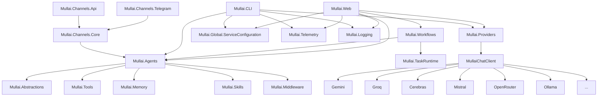

# Mullai — AI Agents & Multi-Agent Workflows

<p align="center">
    <picture>
        
    </picture>
</p>

<p align="center">
  <strong>Build Intelligent, Extensible, and Observant AI Agents and Multi-Agent workflows with .NET</strong>
</p>

<p align="center">
  <a href="https://github.com/agentmatters/mullai-bot/stargazers"></a>
  <a href="https://github.com/agentmatters/mullai-bot/actions/workflows/dotnet.yml?branch=main"></a>
  <a href="https://github.com/agentmatters/mullai-bot/releases/latest"></a>
</p>
<p align="center">
  <a href="https://discord.gg/YhDYt4g6Ja"></a>
  <a href="LICENSE"></a>
</p>

---

> **Note: Active Research & Development**
> Mullai is currently in **active research and development**. While we strive for stability, you may encounter bugs, incomplete features, or breaking changes. We appreciate your patience and welcome contributions to help improve the project!

---


Mullai is a powerful and flexible AI Agent platform built entirely on **.NET**. It provides a robust foundation for creating intelligent, multi-turn conversational AI agents and multi-agent workflows that are equipped with a rich set of **tools, memory, and skills**. Leveraging `Microsoft.Extensions.AI` and `Microsoft.Agents.AI`, Mullai empowers developers to build sophisticated AI assistants with a highly scalable and observable architecture.

<p align="center">
    <picture>
        
    </picture>
</p>

## 🚀 Unified Workflow Dashboard (Web UI)

The primary interface for Mullai is now a **modern Web Dashboard** built with Blazor Server. It provides a premium environment for orchestrating multi-agent systems and monitoring complex workflows.

- **Agent Orchestrator**: Build, run, and monitor multi-agent workflows in real-time.
- **Interactive Chat**: Fluid conversations with rich tool-call visualization and streaming.
- **Visual Task Graph**: See the dependency tree of your agents as they collaborate.
- **Observability Hub**: Monitor provider performance, token usage, and execution traces.
- **Centralized Settings**: Effortlessly manage LLM providers and model configurations in one place.

---

## 🏗️ Multi-Agent Workflows

Mullai features a robust **Workflow Engine** designed for complex orchestration beyond simple chat.

- **Dynamic Execution**: Support for Single-Agent and Parallel-Agent execution strategies.
- **Webhook Integration**: Trigger workflows via standard webhooks for seamless automation.
- **Execution History**: Full persistence and auditing of every task run with detailed state snapshots.

---

## 💻 Developer CLI

For terminal-focused development and quick testing, Mullai continues to offer a **Rich Console Application** (powered by Spectre.Console). It provides high-performance interaction, real-time tool-call insights, and a multi-panel layout for deep debugging directly in your shell.

---

## Quick Install (Binary)

### macOS / Linux (Bash)
Run the following in your terminal:
```bash
curl -sSL https://raw.githubusercontent.com/agentmatters/mullai-bot/main/scripts/install.sh | bash
```

### Windows (PowerShell)
Run the following in PowerShell (as Administrator if you want to update System PATH, though User PATH is default):
```powershell
irm https://raw.githubusercontent.com/agentmatters/mullai-bot/main/scripts/install.ps1 | iex
```

This will:
1. Detect your Operating System and Architecture.
2. Download the latest `Mullai` binary.
3. Install it to `~/.mullai/bin` (or `$HOME\.mullai\bin` on Windows).
4. Add the installation directory to your `PATH`.

---

## Key Features

Mullai is designed for resilience, flexibility, and developer-friendliness:

*   **Multi-Agent Workflow Engine**: Define complex collaboration patterns (sequential or parallel) with full execution history, state persistence, and webhook support.
*   **Multi-Provider with Automatic Fallback**: Seamlessly integrates Gemini, Groq, Cerebras, Mistral, OpenRouter, and Ollama. If one provider fails, Mullai automatically fails over to the next available model.
*   **Unified Web Dashboard**: A premium Blazor-based interface for interactive chat, workflow orchestration, and real-time visualization of agent task graphs.
*   **Rich Tool Ecosystem**: Empower agents with a diverse set of capabilities ranging from system automation to document processing.
*   **Observability Built-in**: Full OpenTelemetry integration providing deep insights via distributed traces, structured logs, and performance metrics.
*   **Robust Middleware Pipeline**: Intercept and process messages at any stage with built-in support for tool-calling, PII scrubbing, and safety guardrails.
*   **Persistent Memory & Skills**: Advanced state management with recursive task trees and dynamic, file-based agent skills.

## Supported Tools

Mullai agents come equipped with a versatile suite of tools to interact with the environment and external services:

| Category | Tool | Description |
| :--- | :--- | :--- |
| **Orchestration** | **WorkflowTool** | Manage, upsert, and execute complex multi-agent workflows. |
| **Automation** | **BashTool** | Execute shell commands and scripts in a terminal environment. |
| | **CliTool** | Run command-line interface tools and capture output. |
| **Development** | **CodeSearchTool** | Perform advanced search and navigation within local codebases. |
| | **FileSystemTool** | Read, write, list, and manage files and directories. |
| **Web & Data** | **WebTool** | Search the web and fetch/summarize content from any URL. |
| | **RestApiTool** | Make authenticated HTTP requests (GET, POST, etc.) to external APIs. |
| | **HtmlToMarkdown** | Convert raw HTML content into clean, readable Markdown. |
| **Documents** | **WordTool** | Create and edit Microsoft Word (.docx) documents via OpenXML. |
| **Productivity** | **TodoTool** | Manage project-specific task lists and todo items. |
| | **WeatherTool** | Retrieve real-time weather data and geolocation information. |

---

## Project Architecture

Mullai is built with a modular and decoupled architecture, promoting maintainability and extensibility.



### Core Components Explained:

*   **`Mullai.Abstractions`**: Defines core interfaces and base classes, ensuring a consistent and extensible foundation.
*   **`Mullai.Agents`**: The brain of Mullai, housing the `AgentFactory` and definitions for various AI agent personalities.
*   **`Mullai.Channels.*`**: Projects like `Mullai.Channels.Core`, `Mullai.Channels.Api`, and `Mullai.Channels.Telegram` enable interaction with agents via different communication platforms (e.g., API, Telegram, WebAssembly).
*   **`src/Mullai.CLI`**: Provides a **Rich Console Application** for interactive agent conversations directly in the terminal.
*   **`Mullai.Global.ServiceConfiguration`**: Centralizes application settings, including LLM model priorities and API keys.
*   **`Mullai.Logging`**: Provides mechanisms for comprehensive logging, including LLM request/response details.
*   **`Mullai.Memory` & `Mullai.Skills`**: Manages conversational state, user-specific data, and dynamic, reusable agent capabilities.
*   **`Mullai.Middleware`**: Offers a powerful interception layer for applying cross-cutting concerns like security, data privacy, and function calling.
*   **`Mullai.Providers`**: Integrates with various LLM backends, abstracting away their differences to provide a unified `MullaiChatClient`.
*   **`Mullai.Telemetry`**: Implements shared OpenTelemetry configuration for distributed tracing, metrics, and structured logging across the entire framework.
*   **`Mullai.Tools`**: Contains external capabilities that agents can invoke, allowing them to interact with the operating system, file system, and other services (e.g., weather data).

---

## 🌐 Supported Providers

Mullai is designed to be provider-agnostic, supporting a wide range of LLM backends through both native integrations and OpenAI-compatible endpoints:

- **Google Gemini**: Native support for Gemini 1.5 Pro, Flash, and 2.0.
- **Groq**: Ultra-fast inference for Llama 3.1, Mixtral, and Gemma.
- **Cerebras**: High-performance compute for Llama 3.1 models.
- **Mistral AI**: Native support for Mistral Large, Pixtral, and Codestral.
- **NVIDIA NIM**: Optimized inference through NVIDIA's model catalog.
- **OpenAI**: Support for GPT-4o, GPT-4 Turbo, and GPT-4o mini.
- **OpenRouter**: Unified access to over 200+ models including **DeepSeek**, **Claude 3.5**, and **Llama 3.1**.
- **Ollama**: Local execution of various open-source models via OpenAI-compatible API.

## Getting Started

Follow these steps to get Mullai up and running quickly.

### Prerequisites

*   (Required for Building) [.NET 10 SDK](https://dotnet.microsoft.com/download/dotnet/10.0)
*   **(Optional)** Docker Desktop for running the OpenTelemetry observability stack (Jaeger, Prometheus).
*   An API key for at least one supported LLM provider (e.g., Gemini, Groq, Cerebras, Mistral, OpenRouter) or a local Ollama instance configured to serve an LLM.

### Setup and Run (From Source)

1.  **Clone the repository:**
    ```bash
    git clone https://github.com/agentmatters/mullai-bot.git
    cd Mullai
    ```

2.  **Run the Web Dashboard (Primary):**
    ```bash
    cd src/Mullai.Web
    dotnet run
    ```
    Access the UI at `http://localhost:5000` (or as specified in the console).

3.  **(Optional) Run the Developer CLI:**
    ```bash
    cd src/Mullai.CLI
    dotnet run
    ```

## Contributing

We welcome contributions from the community! Whether you want to add new LLM providers, create innovative tools or middleware, improve the existing Blazor UI, enhance the CLI, or improve documentation, your efforts are highly appreciated.

Please review our **[Contributing Guidelines](CONTRIBUTING.md)** for detailed information on:
- Code of Conduct
- How to report bugs or suggest enhancements
- Development best practices for C# and .NET
- GitHub workflow, including branching strategy and commit message format
- Adding new features like LLM providers, tools, middleware, and agent personalities
- Security considerations and licensing

---

## License

This project is licensed under the MIT License. See the `LICENSE` file for details.
