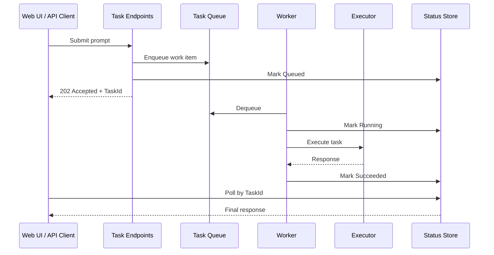
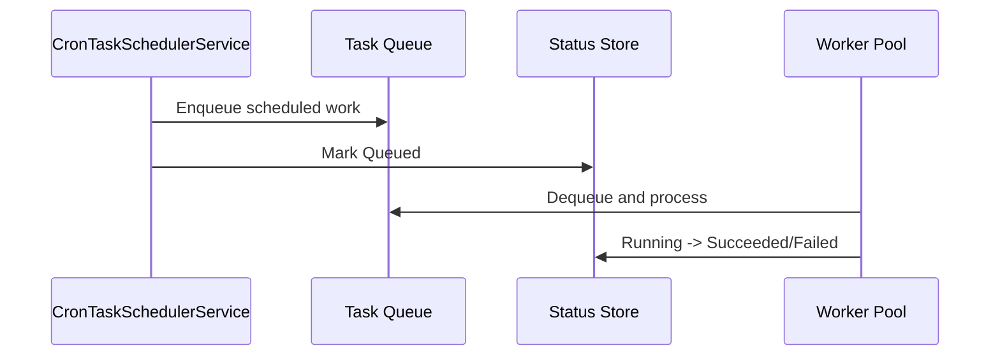
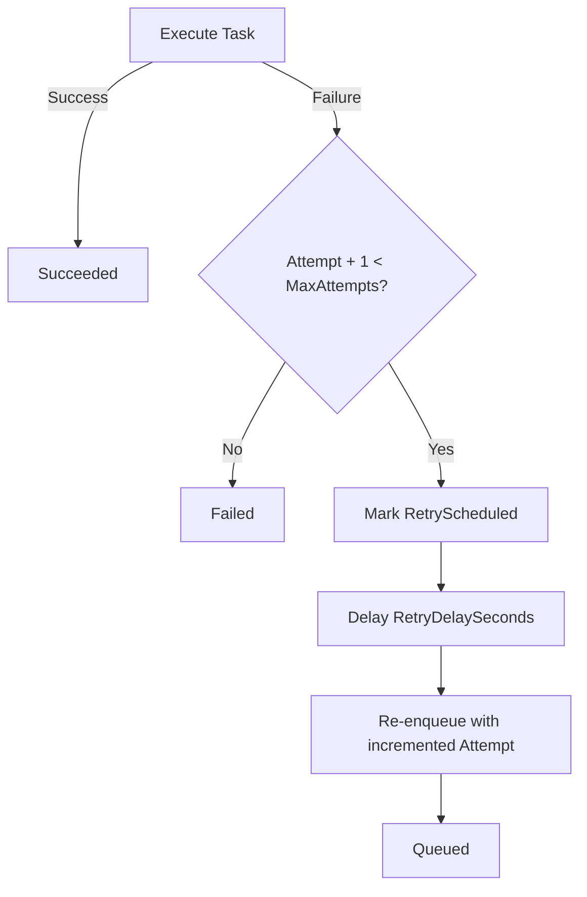

# Mullai Web Task Runtime Architecture

## Why This Runtime Exists

`Mullai.Web` needs a single runtime that can execute many `MullaiAgent` tasks from multiple producers:

- interactive client submissions
- recurring jobs
- future system/internal producers

The runtime separates task ingestion from task execution, supports controlled parallelism, preserves per-session conversation safety, and exposes runtime state for UI and API consumers.

## Design Goals

- **Scalable concurrency**: execute many tasks in parallel with bounded backpressure.
- **Session-safe conversations**: prevent concurrent writes to the same agent session.
- **Source-agnostic ingestion**: support clients, cron, and future producers through one queue.
- **Operational visibility**: track task lifecycle and tool calls.
- **Pluggable infrastructure**: start in-memory, later swap to distributed queue/store.

## High-Level Topology

```mermaid
flowchart LR
    A[Client UI / API] -->|POST task| B[IMullaiTaskQueue]
    C[CronTaskSchedulerService] -->|Enqueue| B

    B --> D[MullaiTaskWorkerService x N]
    D --> E[IMullaiTaskExecutor]
    E --> F[IMullaiTaskClientFactory]
    F --> G[WebMullaiClient / BaseMullaiClient]
    G --> H[AgentFactory -> MullaiAgent]

    D --> I[IMullaiTaskStatusStore]
    A -->|GET status| I

    H --> J[FunctionCallingMiddleware]
    J --> K[IMullaiToolCallFeed]
    A -->|poll tool feed (UI path)| K
```

## Runtime Components

### Ingestion

- `IMullaiTaskQueue`: queue abstraction for incoming work.
- `InMemoryMullaiTaskQueue`: bounded channel queue (`BoundedChannelFullMode.Wait`) to enforce backpressure.

Current code:

- `src/Mullai.TaskRuntime/TaskRuntime/Abstractions/IMullaiTaskQueue.cs`
- `src/Mullai.TaskRuntime/TaskRuntime/Services/InMemoryMullaiTaskQueue.cs`

### Execution

- `MullaiTaskWorkerService` runs a configurable worker pool.
- Worker loop responsibilities:
  - dequeue one task
  - mark status `Running`
  - execute task via `IMullaiTaskExecutor`
  - mark `Succeeded` or retry/fail
  - During execution the worker streams from `IMullaiTaskExecutor`, which now surfaces each partial response string via a callback so the runtime can update observers while the agent is still running.

Current code:

- `src/Mullai.TaskRuntime/TaskRuntime/Services/MullaiTaskWorkerService.cs`
- `src/Mullai.TaskRuntime/TaskRuntime/Services/MullaiTaskExecutor.cs`

### Client/Session Binding

- `WebMullaiClientFactory` caches clients by key: `"{agentName}::{sessionKey}"`.
- This gives one logical agent client per session.
- `BaseMullaiClient` serializes execution with an internal lock to protect session integrity.

Current code:

- `src/Mullai.TaskRuntime/TaskRuntime/Clients/WebMullaiClientFactory.cs`
- `src/Mullai.TaskRuntime/TaskRuntime/Clients/WebMullaiClient.cs`
- `src/Mullai.Agents/Clients/BaseMullaiClient.cs`

### Status Tracking

- `IMullaiTaskStatusStore` stores runtime lifecycle snapshots.
- `InMemoryMullaiTaskStatusStore` currently stores snapshots in memory.

Task lifecycle states:

- `Queued`
- `Running`
- `RetryScheduled`
- `Succeeded`
- `Failed`
- `MarkRunningAsync` now accepts an optional response string so the status snapshot can carry partial assistant text before the task succeeds.

Current code:

- `src/Mullai.TaskRuntime/TaskRuntime/Abstractions/IMullaiTaskStatusStore.cs`
- `src/Mullai.TaskRuntime/TaskRuntime/Services/InMemoryMullaiTaskStatusStore.cs`
- `src/Mullai.TaskRuntime/TaskRuntime/Models/MullaiTaskState.cs`

### Scheduling (Recurring Jobs)

- `CronTaskSchedulerService` loads jobs from configuration.
- Jobs are interval-driven (not cron expression parsing yet).
- Each scheduled run enqueues a normal task with `Source = Cron`.

Current code:

- `src/Mullai.TaskRuntime/TaskRuntime/Services/CronTaskSchedulerService.cs`
- `src/Mullai.TaskRuntime/TaskRuntime/Options/MullaiRecurringTaskOptions.cs`

### Tool Call Observability

- `FunctionCallingMiddleware.OnToolCallObserved` is wired in `Program.cs`.
- Observations are stored in `IMullaiToolCallFeed`.
- Runtime attaches task context with `AsyncLocal` scope (`taskId`, `sessionKey`) so tool events can be correlated to the running task.

Current code:

- `src/Mullai.Web/Program.cs`
- `src/Mullai.TaskRuntime/TaskRuntime/Services/InMemoryMullaiToolCallFeed.cs`
- `src/Mullai.TaskRuntime/TaskRuntime/Execution/MullaiTaskExecutionContext.cs`

## Task Data Model

Core model: `MullaiTaskWorkItem`

Fields with architectural meaning:

- `TaskId`: immutable identifier for tracking.
- `SessionKey`: binds work to a logical conversation lane.
- `AgentName`: agent selection key (default `Assistant`).
- `Prompt`: user/system payload.
- `Source`: producer type (`Client`, `Cron`, `System`).
- `Attempt` and `MaxAttempts`: retry behavior control.
- `Metadata`: extension bag for producer context.

Current code:

- `src/Mullai.TaskRuntime/TaskRuntime/Models/MullaiTaskWorkItem.cs`
- `src/Mullai.TaskRuntime/TaskRuntime/Models/MullaiTaskSource.cs`

## End-to-End Flows

### 1) Client Task Flow



### 2) Recurring Task Flow



### 3) Retry Flow



## Concurrency and Safety Semantics

### Global Parallelism

- `WorkerCount` controls how many workers execute in parallel.
- Throughput scales by increasing workers and host replicas.

### Queue Backpressure

- Queue is bounded by `QueueCapacity`.
- When full, producers await capacity (`Wait` mode) instead of dropping tasks.

### Per-Session Ordering

- Client factory uses one client per `(agentName, sessionKey)`.
- `BaseMullaiClient` execution lock serializes agent calls per client instance.
- This avoids race conditions where multiple tasks mutate one agent session simultaneously.

## Configuration Surface

`appsettings.json` sections:

- `Mullai:TaskRuntime`
- `Mullai:RecurringTasks`

Runtime options:

- `QueueCapacity`
- `WorkerCount`
- `DefaultMaxAttempts`
- `RetryDelaySeconds`

Recurring job options:

- `Name`, `Enabled`, `RunOnStartup`
- `IntervalSeconds`
- `SessionKey`, `AgentName`
- `Prompt`, `MaxAttempts`

Related code:

- `src/Mullai.TaskRuntime/TaskRuntime/Options/MullaiTaskRuntimeOptions.cs`
- `src/Mullai.TaskRuntime/TaskRuntime/Options/MullaiRecurringTaskOptions.cs`

## API Surface

Task runtime endpoints are under `/api/mullai/tasks`:

- `POST /` submit task
- `GET /{taskId}` fetch one task snapshot
- `GET /?take=50` fetch recent snapshots

Detailed contract examples: [API.md](./API.md)

## Failure and Recovery Model

Current behavior:

- task failures are retried until `MaxAttempts` is exhausted
- final state is persisted as `Failed` with error message
- task queue and status are in-memory; process restarts lose runtime state

Production implication:

- use durable queue and durable status store for restart-safe semantics

## Scalability and Production Hardening

### What Is Production-Ready Now

- clear contracts (`queue`, `executor`, `status`, `client factory`)
- bounded queue and worker pool
- retries and observable status transitions
- tool-call correlation via task context

### What To Upgrade for Multi-Node Production

1. Replace `InMemoryMullaiTaskQueue` with distributed queue.
2. Replace `InMemoryMullaiTaskStatusStore` with durable store.
3. Add dead-letter queue for exhausted retries.
4. Add idempotency key for producer retries.
5. Add priority queues and per-tenant quotas.
6. Add autoscaling policies on queue depth and processing latency.
7. Add retention/TTL policy for status/tool-feed records.

## Extension Points

To add a new task producer:

1. create `MullaiTaskWorkItem`
2. enqueue via `IMullaiTaskQueue`
3. mark `Queued` in `IMullaiTaskStatusStore`

To add a new storage backend:

- implement `IMullaiTaskQueue` and/or `IMullaiTaskStatusStore`
- swap registrations in `AddMullaiTaskRuntime`

To add a new execution strategy:

- implement `IMullaiTaskExecutor`
- keep task lifecycle contract unchanged

## Source Map

- DI composition: `src/Mullai.TaskRuntime/TaskRuntime/MullaiTaskRuntimeServiceCollectionExtensions.cs`
- Endpoints: `src/Mullai.TaskRuntime/TaskRuntime/MullaiTaskEndpoints.cs`
- Worker engine: `src/Mullai.TaskRuntime/TaskRuntime/Services/MullaiTaskWorkerService.cs`
- Scheduler: `src/Mullai.TaskRuntime/TaskRuntime/Services/CronTaskSchedulerService.cs`
- Client factory/session model: `src/Mullai.TaskRuntime/TaskRuntime/Clients/WebMullaiClientFactory.cs`
- Tool feed: `src/Mullai.TaskRuntime/TaskRuntime/Services/InMemoryMullaiToolCallFeed.cs`
